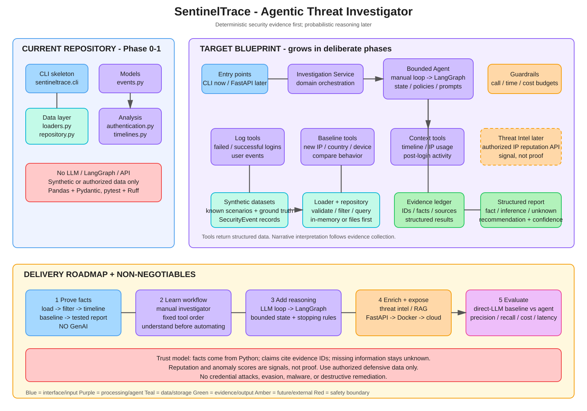

# SentinelTrace Architecture



The editable architecture diagram is available at [`sentineltrace-architecture.excalidraw`](./sentineltrace-architecture.excalidraw).

Open the file with [Excalidraw](https://excalidraw.com/) or an editor that supports `.excalidraw` files.

## Diagram Scope

The diagram intentionally separates the current repository from the target blueprint:

- **Current:** Python package setup and the deterministic Phase 1 log-analysis foundation.
- **Next:** Manual investigation orchestration, followed by a small LLM tool loop.
- **Target:** A bounded LangGraph investigator with structured evidence, reporting, evaluation, and optional API/cloud integrations.

The project boundary is defensive: use synthetic, public-safe, anonymized, or explicitly authorized telemetry only. Python produces numerical facts and tool results; later agent layers plan investigations and explain claims without turning unsupported signals into proof.

## Main Flow

```text
CLI / FastAPI
      |
      v
Investigation Service
      |
      v
Bounded Agent or Manual Investigator
      |
      +--> deterministic log, baseline, and context tools
      |             |
      |             v
      |       structured evidence
      |             |
      |             v
      +------> validated report
```

Threat intelligence, RAG, Docker, AWS, and hosted model services are future integrations. They are deliberately shown as later additions rather than current dependencies.
